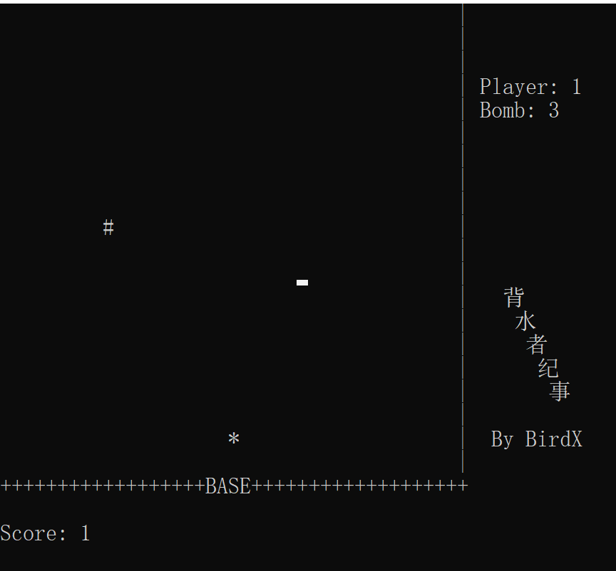

# 命令行界面STG游戏——背水者纪事

本人第一个独立业余项目...非常粗糙。但算是第一步吧。
虽说使用C++编写，但那时还没有深入了解OOP，完全是面向过程编程（笑
游戏难度其实不小，有闲心者大可以挑战挑战。

游戏叫做背水者纪事，讲述了我方空军最后一架飞机背水一战誓死保卫基地的故事。（可见这个人非常无聊，这么粗糙的一个小游戏还要费心思起标题想剧情x）

使用方法：在任意C++项目里将源文件放入，然后编译就好了。

程序界面：

